# Theming

A single Catppuccin flavour drives every themed app in this repo. Change it once per host, rebuild, and the new colours cascade everywhere.

---

## 1. Change the flavour

Edit your host's `home.nix`:

```nix
modules.theme = {
  enable = true;
  flavour = "frappe";  # latte | frappe | macchiato | mocha
};
```

Then rebuild:

```zsh
make <hostname>
```

New shells pick up the change immediately. nvim picks it up on next launch (it reads `$CATPPUCCIN_FLAVOUR`, exported via `home.sessionVariables`).

---

## 2. How it cascades

```mermaid
flowchart LR
  H[hosts/&lt;host&gt;/home.nix<br/>modules.theme.flavour] --> T[modules/theme]
  T -->|catppuccin.flavor| U[catppuccin/nix<br/>home-manager module]
  T -->|home.sessionVariables<br/>CATPPUCCIN_FLAVOUR| E[shell env]
  T -->|modules.theme.palette| P[hex palette attrset]

  U -->|catppuccin.&lt;app&gt;.enable| A1[bat / fzf / starship / delta /<br/>zed / ...]
  E --> N[nvim<br/>lua reads vim.env.CATPPUCCIN_FLAVOUR]
  T -->|cfg.flavour| G[ghostty / zellij / opencode<br/>via pkgs.replaceVars or string interp]
  P --> C[claude-statusline<br/>via pkgs.replaceVars]
```



Three integration patterns are used:

| Pattern | When to use | Example modules |
|---|---|---|
| `catppuccin.<app>.enable = true` | Upstream [catppuccin/nix](https://github.com/catppuccin/nix) ships a module for the app | `bat`, `fzf`, `starship`, `git/delta`, `zed` |
| `pkgs.replaceVars` with `config.modules.theme.flavour` | App takes a theme name in a raw config file | `ghostty`, `zellij` |
| `pkgs.replaceVars` with `config.modules.theme.palette.<colour>` | App takes raw hex codes in a raw config file | `claude-code` (statusline) |
| String interpolation in `programs.<app>.settings` | Nix-native settings, no upstream module | `opencode` |
| `home.sessionVariables` → `vim.env.X` in lua | Out-of-store-symlinked configs (e.g. lazy.nvim) | `nvim` |

---

## 3. Adding a new themed app

### Case A — upstream catppuccin/nix module exists

Check [`modules/home-manager/`](https://github.com/catppuccin/nix/tree/release-25.11/modules/home-manager) on the matching release branch. If your app is there:

```nix
# in your app's modules/<app>/default.nix
config = mkIf cfg.enable {
  programs.<app>.enable = true;
  catppuccin.<app>.enable = true;
};
```

That's it. The flavour comes from `config.modules.theme.flavour` automatically.

### Case B — app reads a theme name from a raw config file

Use `pkgs.replaceVars` (same pattern as `modules/ghostty/`, `modules/zellij/`):

```nix
config = mkIf cfg.enable {
  home.file.".config/<app>/config".source =
    pkgs.replaceVars ./config {
      theme = "catppuccin-${config.modules.theme.flavour}";
    };
};
```

In the templated config file, use `@theme@` where the theme name goes.

### Case C — app's config uses raw hex values

Use `config.modules.theme.palette` (same pattern as `modules/claude-code/`):

```nix
let palette = config.modules.theme.palette;
in {
  home.file.".config/<app>/colors".source =
    pkgs.replaceVars ./colors {
      inherit (palette) blue green mauve;
    };
}
```

In the templated file, use `@blue@`, `@green@`, etc. Available keys: `rosewater flamingo pink mauve red maroon peach yellow green teal sky sapphire blue lavender text subtext1 subtext0 overlay2 overlay1 overlay0 surface2 surface1 surface0 base mantle crust`.

### Case D — Nix-managed settings attrset, no upstream module

Set the theme value directly in the `programs.<app>.settings` block:

```nix
programs.<app>.settings.theme = "catppuccin-${config.modules.theme.flavour}";
```

---

## 4. What's NOT themed by `modules.theme`

These modules use a different theme on purpose. Don't change them as part of a flavour swap:

| Module | Active theme | Where it's set |
|---|---|---|
| `nvim` alt-colorschemes | Various | `lua/plugins/{onedark,tokyonight,github-theme,...}.lua` — gated by `vim.g.active_color_scheme` in `init.lua` |

If you want to migrate any of these to Catppuccin, follow one of the patterns in §3.

---

## 5. Caveats

- **Don't set `catppuccin.enable = true` globally.** Upstream's `mkCatppuccinOption` defaults every per-app `catppuccin.<app>.enable` to `config.catppuccin.enable`, so flipping it on auto-enables every module — including ones that conflict with our hand-templated configs (zellij, ghostty, nvim) and ones we deliberately keep on Tokyo Night. `modules/theme/default.nix` sets `flavor`/`accent` but **not** `enable`.
- **`catppuccin/nix` is pinned to `release-25.11`** to match the home-manager release. The `main` branch references home-manager options that don't exist on stable yet (e.g. `programs.antigravity`). When bumping home-manager, bump the catppuccin branch in lockstep.
- **Not every app is on the release branch.** `opencode` is in `main` but not in `release-25.11`, so we set its theme directly via string interpolation. If you upgrade catppuccin/nix and your app shows up on the release branch, migrate it to Case A.
- **nvim flavour change requires a new shell**, not just `:source`. The flavour is read from `$CATPPUCCIN_FLAVOUR` which is exported by `home.sessionVariables` via shell init. Existing nvim sessions and existing shells keep the old value.
