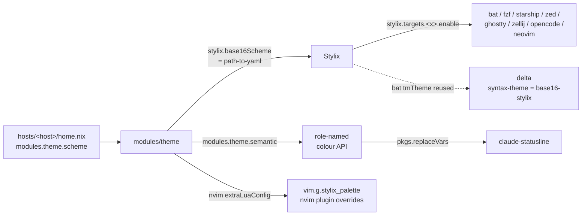

# Theming

A single [base24](https://github.com/tinted-theming/home/blob/main/styling.md) colour scheme drives every themed app in this repo. Pick a scheme, set it on your host, rebuild, and the new colours cascade everywhere.

The plumbing is [Stylix](https://github.com/nix-community/stylix) over scheme files from [tinted-theming/schemes](https://github.com/tinted-theming/schemes) (the canonical base16/base24 repo). Stylix takes a scheme YAML, derives a palette, and applies it to each opt-in target.

---

## 1. Change the scheme

Edit your host's `home.nix`:

```nix
modules.theme.scheme = "base24-catppuccin-macchiato";
```

The value is the tinted-theming scheme ID — same string shown in the [tinted-gallery](https://tinted-theming.github.io/tinted-gallery/) and used as tinted-vim's colorscheme filename. Format: `<system>-<name>`, where `<system>` is `base16` or `base24`.

Then rebuild:

```zsh
make <hostname>
```

Restart long-running apps (ghostty, zellij) to pick up the new theme. nvim picks it up on next launch — the palette is templated into `init.lua` at build time.

If you pick a *light* scheme, flip polarity too so Stylix picks the right contrast directions:

```nix
modules.theme = {
  scheme = "gruvbox-light-medium";
  polarity = "light";
};
```

---

## 2. Finding schemes

Available schemes are the YAML files in [`tinted-theming/schemes`](https://github.com/tinted-theming/schemes) — either the [`base24/`](https://github.com/tinted-theming/schemes/tree/spec-0.11/base24) directory (richer 24-slot palette with bright accents) or [`base16/`](https://github.com/tinted-theming/schemes/tree/spec-0.11/base16) (16-slot). Set `modules.theme.scheme` to `<system>-<filename-without-yaml>`; the prefix matches the directory the YAML lives in. Most schemes have both variants (use `base24-`); some (e.g. `later-this-evening`) are base24-only.

**Browse visually:**
- [Tinted gallery](https://tinted-theming.github.io/tinted-gallery/) — previews every scheme rendered against real syntax highlighting.
- [tinted-theming/schemes README](https://github.com/tinted-theming/schemes#schemes-list) — full list with author + polarity.

**Common picks** (all `base24-` prefixed unless noted):
- Catppuccin family: `base24-catppuccin-latte`, `base24-catppuccin-frappe`, `base24-catppuccin-macchiato`, `base24-catppuccin-mocha`
- Gruvbox family: `base24-gruvbox-dark-{soft,medium,hard}`, `base24-gruvbox-light-{soft,medium,hard}`, `base24-gruvbox-material-{dark,light}-{soft,medium,hard}`
- Other dark favourites: `base24-nord`, `base24-tokyo-night-storm`, `base24-dracula`, `base24-everforest`, `base24-kanagawa`, `base24-rose-pine`, `base24-rose-pine-moon`, `base24-solarized-dark`
- Light: `base24-rose-pine-dawn`, `base24-solarized-light`, `base16-default-light`

> **base24 vs base16**: base24 schemes get a 24-slot palette with bright accent variants at `base10`-`base17` (e.g. tinted-vim's `@function` uses the bright-blue slot for richer rendering). base16 schemes are 16-slot. Consuming code that references extended slots (like nvim's `vim.g.stylix_palette.base17`) falls back to base equivalents on base16 schemes (`base17 → base0E`, etc.), so nothing breaks — you just get the base-variant colour where a bright variant would've been used.
>
> `modules.theme.system` is a read-only option derived from `scheme`'s prefix. Inspect with `nix eval '.#…modules.theme.system'`.

---

## 3. How it cascades



Two consumption patterns:

| Pattern | When to use | Example modules |
|---|---|---|
| `stylix.targets.<x>.enable = true` | Stylix ships a target for the app | bat, fzf, starship, zed, ghostty, zellij, opencode, neovim |
| `pkgs.replaceVars` with `modules.theme.semantic.<role>` | Hand-templated config consuming `#rrggbb` strings | claude-code (statusline) |

`modules.theme.semantic` exposes a role-named view of the active palette:

| Role | Slot | Use for |
|---|---|---|
| `bg` / `bgAlt` | base00 / base01 | editor body / recessed panel |
| `fg` / `fgAlt` | base05 / base04 | regular text / muted text |
| `primary` | base0D | "this is the thing" — usually blue |
| `success` | base0B | usually green |
| `warning` | base0A | usually yellow |
| `error` | base08 | usually red |
| `info` | base0C | usually cyan/teal |
| `accent` / `accentAlt` / `accentBright` | base0E / base07 / base17 | mauve / lavender / bright variant |

Use these rather than base24 slot numbers — your config stays readable after a scheme switch and the role mapping is portable across themes.

---

## 4. Adding a new themed app

### Case A — Stylix has a target

Browse [stylix/modules/](https://github.com/nix-community/stylix/tree/master/modules) — if your app is listed:

```nix
config = mkIf cfg.enable {
  programs.<app>.enable = true;
  stylix.targets.<app>.enable = true;
};
```

### Case B — App's config uses raw hex values

```nix
let
  inherit (config.modules.theme) semantic;
in {
  home.file.".config/<app>/colors".source =
    pkgs.replaceVars ./colors {
      inherit (semantic) primary success accent warning;
    };
}
```

In the templated file, use `@primary@`, `@success@`, etc. where the hex would go. Values are `#`-prefixed (`#rrggbb`).

### Case C — App reads a syntect theme

Apps using [syntect](https://github.com/trishume/syntect) (delta, hexyl, …) can reuse the `tmTheme` Stylix generates for bat. Set the app's syntax-theme option to `"base16-stylix"`:

```nix
programs.<app>.options.syntax-theme = "base16-stylix";
```

(See `modules/git/default.nix` for the delta example.)

---

## 5. nvim-specific

nvim is the most invasive consumer. The full base24 palette is templated into `init.lua` as `vim.g.stylix_palette` at build time, so lua overrides can reference scheme slots directly:

```lua
local p = vim.g.stylix_palette
vim.api.nvim_set_hl(0, "MyGroup", { fg = p.base0D, bg = p.base00 })
```

See `modules/nvim/config/lua/autocmds.lua` and the barbecue/lualine plugin specs for palette-driven override examples. Stylix's `base16-nvim` plugin (installed via lazy with `priority = 1000` to survive lazy's rtp reset) handles the majority of standard highlight groups; the lua overrides exist only to fix the specific groups base16-nvim leaves bare or maps to a too-low-contrast slot.

---

## 6. Caveats

- **`stylix.autoEnable = false`**: every target opts in explicitly. A future Stylix release adding a target won't surprise-theme an app we hand-template.
- **Scheme switch requires a rebuild**: `modules.theme.scheme` evaluates at nix build time. There's no runtime hot-reload — deliberate trade-off for reproducibility. Run `make <host>` after the change.
- **Polarity matters**: dark schemes default to `polarity = "dark"`; light schemes need `polarity = "light"`. Stylix uses this for some target's contrast-direction decisions.
- **Long-running apps need a restart**: ghostty, zellij, nvim sessions in progress keep their old palette until relaunched.
