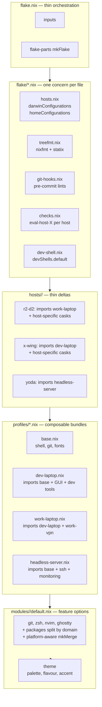

# Refactor: Modernize the flake structure

**Status**: draft, not yet started.
**Owner**: @phamann.
**Author**: research + plan by Claude (Opus 4.7), 2026-05-13.

---

## 0. TL;DR

The current repo follows the "enable-flag home-manager module" pattern from ~2023. It works. The friction points are:

1. Adding a module requires touching 3 files (`modules/<name>/default.nix`, `modules/default.nix`, every `hosts/*/home.nix`).
2. Each host enables ~15 modules individually instead of composing a profile.
3. `flake.nix` carries hand-rolled `pkgsForSystem`, `hostHomeWithSystem`, `darwinHostWithSystem` helpers that flake-parts would express in fewer lines.
4. No `formatter`, no `nix flake check`, no `devShell`, no CI. `with lib;` is used at the top of every module (now mildly discouraged).
5. There is no NixOS escape hatch: if you ever add a NixOS host, every current module needs to be rewritten to expose itself outside the home-manager option tree.

The plan:

- Adopt **flake-parts** (light touch, library not framework) and split `flake.nix` into `flake/*.nix` files.
- Introduce **profiles** (`profiles/dev-laptop.nix`, `profiles/headless-server.nix`, etc.) that bundle module enables; hosts become thin deltas.
- Make modules **platform-aware** via `lib.mkMerge` + `pkgs.stdenv.hostPlatform.isDarwin/isLinux` so they keep working in NixOS later for free.
- Add the modern hygiene stack: `nixfmt-rfc-style` via `treefmt-nix`, `statix`+`deadnix` via `git-hooks.nix`, eval-checks per host, a small `devShell`, and GitHub Actions running `nix flake check`.
- **Do not** adopt snowfall-lib or full dendritic (`flake.modules.<class>.<name>` + `import-tree`) in the first pass — keep the option open as a Phase 5+ evolution.

Migrate in 6 phases. Each is independently shippable; you can stop after any phase and still have a coherent repo.

---

## 1. What the current repo looks like

### 1.1 Inventory

```
.config/nixpkgs/
├── flake.nix                       # 121 lines: inputs + 3 helpers + outputs
├── flake.lock
├── config.nix                      # 1 line: nixpkgs config
├── Makefile                        # 4 targets: update, x-wing, r2-d2, yoda
├── CLAUDE.md
├── docs/{SETUP,THEMING}.md
├── plans/claude-code.md
├── scripts/aliasApplications.nix   # disabled (darwin.apple_sdk_11_0 removed)
├── hosts/
│   ├── x-wing/{configuration,home}.nix
│   ├── r2-d2/{configuration,home}.nix
│   └── yoda/home.nix
└── modules/
    ├── default.nix                 # imports all subdirs
    ├── lib/mcp-wrappers.nix
    └── <20 module dirs>/default.nix
```

### 1.2 Patterns in use today

**Module pattern** — every module is a home-manager module with an enable flag:

```nix
# modules/git/default.nix
{ pkgs, lib, config, ... }:
with lib;
let cfg = config.modules.git;
in {
  options.modules.git = { enable = mkEnableOption "git"; };
  config = mkIf cfg.enable {
    programs.git = { ... };
  };
}
```

**Host pattern** — every host re-lists every module's enable:

```nix
# hosts/r2-d2/home.nix
modules = {
  alacritty.enable = false;
  bat.enable = true;
  claude-code.enable = true;
  direnv.enable = true;
  fzf.enable = true;
  ghostty.enable = true;
  git.enable = true;
  gpg.enable = true;
  gui.enable = true;
  kitty.enable = false;
  nvim.enable = true;
  packages.enable = true;
  ssh.enable = true;
  starship.enable = true;
  theme = { enable = true; flavour = "mocha"; };
  tmux.enable = true;
  zed.enable = true;
  zellij.enable = true;
  zsh.enable = true;
  opencode.enable = true;
};
```

`x-wing`, `r2-d2`, and `yoda` each carry near-identical blocks like this — every new module means three edits.

**`flake.nix` helpers** — three hand-rolled functions glue everything together:

```nix
pkgsForSystem        = system:        import nixpkgs { overlays = [ ... ]; ... };
hostHomeWithSystem   = host: system:  home-manager.lib.homeManagerConfiguration { ... };
darwinHostWithSystem = host: system: user: darwin.lib.darwinSystem { ... };
```

### 1.3 What's already good

Worth preserving — don't lose these in the refactor:

- **`modules.theme.palette`** exposes Catppuccin hex values as a read-only option, consumed via `pkgs.replaceVars` (see `docs/THEMING.md`). This is well-designed: it's a *typed library API* for other modules.
- **`programs.git.settings = {...}`** uses the home-manager 25.11 settings-attrset API, not the older `extraConfig` string. Other modules also lean on modern HM options (`programs.zsh.initContent`, `lib.mkOrder`).
- **`modules.packages.additional-packages`** option lets hosts append host-specific packages to a shared list. The mechanism is good; only the shape (one giant 100-line list) is dated — better split by domain.
- **`programs.claude-code` + `palette` cross-module dependency** demonstrates that module-to-module typed sharing already works via `config.modules.<name>` — this is the right ground truth to build on.

### 1.4 What's dated / friction

- `with lib;` at every module top. RFC-style and the nixpkgs tracking issue ([#208242](https://github.com/NixOS/nixpkgs/issues/208242)) discourage it. Modern idiom: `inherit (lib) mkOption mkEnableOption mkIf mkMerge types;`.
- No `lib.mkMerge` + platform branches: modules silently assume HM. None can be reused by a NixOS host. A few use `pkgs.stdenv.isDarwin` inline (`hosts/*/home.nix`) — fine for `homeDirectory` but doesn't scale.
- `modules/default.nix` is a hand-maintained import list. Drift between this and the host opt-ins is the most common foot-gun.
- `modules/packages/default.nix` is a 100-line single list mixing CLI, k8s, languages, GUI. Hard to enable subsets per host. Hosts work around it via `additional-packages`, which is the wrong direction — host-specific *additions* are fine, but host-specific *omissions* are awkward.
- `nvim` uses `mkOutOfStoreSymlink` against the live repo path. Fine for dev, broken for anyone else cloning the repo. Should be gated by `modules.nvim.dev = true`, defaulting `false`.
- No `nix fmt`. No `nix flake check`. No `devShell`. No CI. Eval breakage on `yoda` is invisible when you rebuild only on `r2-d2`.
- `Makefile` uses `--impure` for darwin-rebuild. The only impurity is `$USER` — solvable, removing the `--impure` flag.
- `modules/lib/mcp-wrappers.nix` is imported with `import ../lib/mcp-wrappers.nix { inherit pkgs; }` — fine, but a `lib.callPackages` pattern or moving it into a `flake.lib` output would be more idiomatic.

---

## 2. State of the art (2025-2026)

Fresh survey — pulled from current flake-parts docs, the dendritic-pattern Discourse thread (May 2025), and 4 actively-maintained reference repos.

### 2.1 flake-parts has won the composition layer

The community has converged on **[flake-parts](https://flake.parts)** (by `hercules-ci`, the Hercules CI maintainers) as the de-facto way to compose flake outputs. It's a *library*, not a framework: you write `flake-parts.lib.mkFlake { ... }`, list `imports`, and each imported flake-module contributes outputs declaratively. Key benefits relative to hand-rolled flakes:

- `perSystem = { pkgs, system, ... }: { ... }` replaces hand-rolled `forEachSystem` and `pkgsForSystem` helpers.
- Third-party flake-modules slot in cleanly: `treefmt-nix.flakeModule`, `git-hooks.flakeModule`, `home-manager.flakeModules.home-manager`, `flake-root.flakeModule`.
- You can split `flake.nix` into `flake/*.nix` files where each owns one concern (hosts, checks, devshell, formatter, etc.).

snowfall-lib (the main alternative) has clearly lost momentum: opaque errors, breaking API churn across v1→v2→v3, infinite-recursion bugs at scale. Several high-profile users have migrated *away* from it. Skip it.

### 2.2 The dendritic pattern (newer, optional)

[Dendritic](https://discourse.nixos.org/t/the-dendritic-pattern/61271) (May 2025, by `mightyiam`) takes flake-parts to its logical extreme: every `.nix` file in the repo *is* a flake-parts module, auto-discovered via [`vic/import-tree`](https://github.com/vic/import-tree). Configurations expose under `flake.modules.<class>.<name>` where `<class>` is `nixos`, `darwin`, or `homeManager`. A `flake.nix` becomes:

```nix
outputs = inputs: inputs.flake-parts.lib.mkFlake { inherit inputs; }
  (inputs.import-tree ./modules);
```

Pros: maximum DRY, zero import boilerplate, single canonical place for cross-class modules.
Cons: more "magic" — when something breaks, the error surface is wider; specialArgs becomes an anti-pattern (everything flows through `flake.modules`); requires conceptual buy-in to the flake-parts module system.

**Recommendation**: don't go dendritic in Phase 1. It's a Phase 5+ option once you have profiles working and you've decided you want NixOS hosts. The flake-parts setup we build in Phase 2 is forward-compatible — adding `import-tree` later is a one-line drop-in.

### 2.3 Reference repos worth studying

| Repo | What's worth stealing |
|---|---|
| [Mic92/dotfiles](https://github.com/Mic92/dotfiles) | "flake.nix is just plumbing" pattern: one `flake-module.nix` per concern (`nixosModules/`, `home-manager/`, `devshell/`). Inventory of hosts in a separate file. Mature, no magic. |
| [ryan4yin/nix-config](https://github.com/ryan4yin/nix-config) | Multi-platform without flake-parts; `home/{base,linux,darwin}/` split for cross-platform HM; `core-server.nix` vs `core-desktop.nix` role modules. Good "what good looks like without flake-parts" reference. |
| [Misterio77/nix-config](https://github.com/Misterio77/nix-config) | Feature-flag pattern (`features = [ "desktop" "gaming" ]` per host, modules read `config.features`). Cleaner than 20 booleans but requires rewriting modules. |
| [mightyiam/infra](https://github.com/mightyiam/infra) | The dendritic reference implementation. Read it once to understand what full auto-discovery looks like, then decide whether you want it. |

### 2.4 Modern hygiene stack

| Concern | Tool | Wire-up |
|---|---|---|
| Formatter | `nixfmt` (the RFC 166 nixfmt — official since v1.0.0, Aug 2024) | `treefmt-nix` flake-parts module, `programs.nixfmt.enable = true` |
| Anti-pattern lint | `statix` | via `git-hooks.nix` flake-parts hook |
| Dead-code lint | `deadnix` | via `git-hooks.nix` flake-parts hook |
| Pre-commit hooks | [`cachix/git-hooks.nix`](https://github.com/cachix/git-hooks.nix) (formerly `pre-commit-hooks.nix`) | `inputs.git-hooks.flakeModule` |
| Flake checks | `checks.<system>.eval-<host>` building each `*.config.system.build.toplevel` / `activationPackage` | hand-written |
| devShell | flake-parts `perSystem.devShells.default = pkgs.mkShell { ... }` | plain `mkShell` |
| CI | `DeterminateSystems/nix-installer-action` + `magic-nix-cache-action` + `flake-checker-action` | `.github/workflows/check.yml` |

---

## 3. Target architecture

### 3.1 Layered model



Each layer has one job:

| Layer | Job | Touches |
|---|---|---|
| `flake.nix` | Inputs + `mkFlake` + list flake-modules | rarely |
| `flake/*.nix` | Cross-cutting flake outputs (configurations, checks, formatter) | when adding a host / a check |
| `modules/<name>/` | A single feature, with options and config | when adding a feature |
| `profiles/<role>.nix` | Bundle of module enables for a role | when adding a role |
| `hosts/<name>/` | Hostname + hardware + which profiles | rarely |

### 3.2 Target filesystem

```
.config/nixpkgs/
├── flake.nix                  # ~30 lines: inputs + mkFlake + imports
├── flake.lock
├── flake/
│   ├── hosts.nix              # darwinConfigurations + homeConfigurations
│   ├── checks.nix             # eval-<host> per host
│   ├── treefmt.nix            # nixfmt-rfc-style + statix
│   ├── git-hooks.nix          # pre-commit: nixfmt + statix + deadnix
│   ├── dev-shell.nix          # devShell with nixd, nixfmt, statix, deadnix
│   └── lib.nix                # exports flake.lib (e.g. mkHost helper)
├── modules/                   # unchanged shape, modernized internals
│   ├── default.nix            # OPTIONAL: keep as opt-in aggregator
│   ├── git/default.nix        # `inherit (lib) ...;`, mkMerge for platform
│   ├── packages/
│   │   ├── default.nix        # imports cli.nix, dev.nix, k8s.nix, gui.nix
│   │   ├── cli.nix
│   │   ├── dev.nix
│   │   ├── k8s.nix
│   │   └── gui.nix
│   ├── theme/default.nix      # unchanged — already good
│   └── ... (other modules)
├── profiles/
│   ├── base.nix               # everyone gets: shell, git, fonts, tmux, theme
│   ├── dev-laptop.nix         # base + nvim + ghostty + gui + dev packages
│   ├── work-laptop.nix        # dev-laptop + work-specific (claude-code, slack via brew)
│   └── headless-server.nix    # base + ssh + monitoring, no GUI
├── hosts/
│   ├── r2-d2/
│   │   ├── configuration.nix  # imports profiles/darwin/<role>.nix
│   │   └── home.nix           # imports profiles/work-laptop.nix
│   ├── x-wing/{configuration,home}.nix
│   └── yoda/home.nix          # imports profiles/headless-server.nix
├── lib/
│   └── mcp-wrappers.nix       # moved out of modules/lib/
├── docs/
├── plans/
└── .github/workflows/check.yml
```

### 3.3 Target `flake.nix` (illustrative)

```nix
{
  description = "Patrick Hamann's dotfiles and host configs";

  inputs = {
    nixpkgs.url = "github:nixos/nixpkgs/nixpkgs-25.11-darwin";
    nixpkgs-unstable.url = "github:nixos/nixpkgs/nixpkgs-unstable";

    flake-parts.url = "github:hercules-ci/flake-parts";

    darwin = {
      url = "github:lnl7/nix-darwin/nix-darwin-25.11";
      inputs.nixpkgs.follows = "nixpkgs";
    };
    home-manager = {
      url = "github:nix-community/home-manager/release-25.11";
      inputs.nixpkgs.follows = "nixpkgs-unstable";
    };

    treefmt-nix = { url = "github:numtide/treefmt-nix"; inputs.nixpkgs.follows = "nixpkgs"; };
    git-hooks   = { url = "github:cachix/git-hooks.nix"; inputs.nixpkgs.follows = "nixpkgs"; };
    flake-root.url = "github:srid/flake-root";

    rust-overlay = { url = "github:oxalica/rust-overlay"; inputs.nixpkgs.follows = "nixpkgs"; };
    catppuccin.url = "github:catppuccin/nix/release-25.11";
    claude-code-nix.url = "github:sadjow/claude-code-nix";
  };

  outputs = inputs: inputs.flake-parts.lib.mkFlake { inherit inputs; } {
    systems = [ "aarch64-darwin" "x86_64-linux" ];
    imports = [
      inputs.treefmt-nix.flakeModule
      inputs.git-hooks.flakeModule
      inputs.flake-root.flakeModule
      ./flake/hosts.nix
      ./flake/checks.nix
      ./flake/treefmt.nix
      ./flake/git-hooks.nix
      ./flake/dev-shell.nix
      ./flake/lib.nix
    ];
  };
}
```

### 3.4 Target `flake/hosts.nix` (illustrative)

```nix
{ inputs, lib, withSystem, ... }:
let
  mkDarwin = { host, system, user }: withSystem system ({ pkgs, ... }:
    inputs.darwin.lib.darwinSystem {
      inherit pkgs;
      specialArgs = { inherit inputs; };
      modules = [
        ../hosts/${host}/configuration.nix
        { users.users.${user} = { createHome = false; home = "/Users/${user}"; }; }
        inputs.home-manager.darwinModules.home-manager
        {
          home-manager = {
            useGlobalPkgs = true;
            useUserPackages = true;
            backupFileExtension = "hm-backup";
            users.${user}.imports = [ ../hosts/${host}/home.nix ];
            extraSpecialArgs = { inherit inputs system; };
          };
        }
      ];
    });

  mkHomeManager = { host, system }: withSystem system ({ pkgs, ... }:
    inputs.home-manager.lib.homeManagerConfiguration {
      inherit pkgs;
      modules = [ ../hosts/${host}/home.nix ];
      extraSpecialArgs = { inherit inputs system; };
    });
in {
  flake.darwinConfigurations = {
    x-wing      = mkDarwin { host = "x-wing"; system = "aarch64-darwin"; user = "phamann"; };
    r2-d2       = mkDarwin { host = "r2-d2"; system = "aarch64-darwin"; user = "phamann"; };
    MVNX7235JF  = mkDarwin { host = "r2-d2"; system = "aarch64-darwin"; user = "phamann"; };
  };
  flake.homeConfigurations = {
    "phamann@yoda" = mkHomeManager { host = "yoda"; system = "x86_64-linux"; };
  };
}
```

This is the *same shape* as today's `darwinHostWithSystem`/`hostHomeWithSystem`, but lifted into a flake-parts module and using `withSystem` (provided by flake-parts) so we don't import nixpkgs three times.

### 3.5 Target `profiles/dev-laptop.nix` (illustrative)

```nix
{ ... }:
{
  imports = [ ./base.nix ];

  modules = {
    nvim.enable      = true;
    ghostty.enable   = true;
    gui.enable       = true;
    zed.enable       = true;
    zellij.enable    = true;
    claude-code.enable = true;
    opencode.enable  = true;

    packages = {
      cli.enable = true;
      dev.enable = true;
      k8s.enable = true;
      gui.enable = true;
    };
  };
}
```

And `profiles/base.nix`:

```nix
{ pkgs, ... }:
{
  home = {
    username = "phamann";
    homeDirectory = "/${if pkgs.stdenv.isDarwin then "Users" else "home"}/phamann";
    stateVersion = "22.11";
  };
  programs.home-manager.enable = true;

  modules = {
    bat.enable      = true;
    direnv.enable   = true;
    fzf.enable      = true;
    git.enable      = true;
    gpg.enable      = true;
    ssh.enable      = true;
    starship.enable = true;
    tmux.enable     = true;
    zsh.enable      = true;
    theme.enable    = true;
    packages.cli.enable = true;
  };
}
```

And `hosts/r2-d2/home.nix` collapses to:

```nix
{ pkgs, ... }:
{
  imports = [ ../../profiles/work-laptop.nix ];

  modules = {
    theme.flavour = "mocha";
    packages.additional-packages = with pkgs; [
      tilt argocd bun graphviz kubectl ngrok unstable.colima
      kubernetes-helm caddy conftest grafana-alloy haproxy
      kubeconform kustomize open-policy-agent parallel coreutils
    ];
  };
}
```

20-line enable block → 3 lines.

### 3.6 Target module shape

```nix
# modules/git/default.nix
{ pkgs, lib, config, ... }:
let
  inherit (lib) mkIf mkMerge mkEnableOption;
  cfg = config.modules.git;
  isDarwin = pkgs.stdenv.hostPlatform.isDarwin;
in {
  options.modules.git.enable = mkEnableOption "git";

  config = mkIf cfg.enable (mkMerge [
    {
      programs.git = {
        enable = true;
        settings = { /* shared everywhere */ };
        signing.signByDefault = true;
        ignores = [ ".devenv" ".direnv" ".envrc" "flake.lock" "flake.nix" ".aider*" ];
      };
      programs.delta.enable = true;
      catppuccin.delta.enable = true;
    }
    (mkIf isDarwin {
      programs.git.settings.credential.helper = "osxkeychain";
    })
    (mkIf (!isDarwin) {
      programs.git.settings.credential.helper = "libsecret";
    })
  ]);
}
```

Two changes vs today: drop `with lib;`, and use `mkMerge` for platform branches. Mechanical edits, no behaviour change for darwin.

---

## 4. Phased migration

Each phase ends in a working repo. Stop after any phase.

### Phase 1 — Hygiene quick wins (no architectural changes)

Goal: low-risk modernization that pays back immediately.

**Changes:**

- **`with lib;` → `inherit (lib) ...;`** at the top of each module. Mechanical pass, ~20 files.
- **`mkOutOfStoreSymlink` for nvim** behind a new `modules.nvim.dev = mkEnableOption "live-symlinked nvim config"` (default `false`). Without it, `xdg.configFile.nvim` is a regular store path. Set `modules.nvim.dev = true` on your hosts; anyone else cloning the repo gets a reproducible nvim.
- **Delete `darwinConfigurations.MVNX7235JF`** entirely — old work-machine relic per Decision D2.
- **Drop `--impure`** from `Makefile` and add explicit flake fragments. The `r2-d2` / `x-wing` targets become `darwin-rebuild switch --flake ~/.config/nixpkgs#r2-d2` (etc.) so hostname auto-discovery and `$USER` impurity both go away.
- **Move `modules/lib/mcp-wrappers.nix` → `lib/mcp-wrappers.nix`** to separate the option-tree from generic helpers. Update the one import in `modules/claude-code/default.nix`.
- **Split `modules/packages/default.nix`** into sub-modules `modules/packages/{cli,dev,k8s,gui}/default.nix`, each with its own `mkEnableOption`. The current host-level `modules.packages.additional-packages` lists migrate as follows:
  - r2-d2's k8s tools (`kubectl`, `kubernetes-helm`, `kubeconform`, `kustomize`, `conftest`, `open-policy-agent`, `tilt`, `argocd`) → `modules/packages/k8s/default.nix`.
  - r2-d2's `bun`, `graphviz` → `modules/packages/dev/default.nix`.
  - r2-d2's `coreutils`, `parallel` → `modules/packages/cli/default.nix`.
  - r2-d2's incident.io-specific (`caddy`, `haproxy`, `grafana-alloy`, `ngrok`) → stay in `additional-packages` for now; they'll move to `profiles/work-laptop.nix` in Phase 4.
  - x-wing's adds collapse entirely into the new sub-modules.
- **`programs.zsh.envExtra` audit** (per Decision D4):
  - **Delete** the perl5 stanza (`PATH`, `PERL5LIB`, `PERL_LOCAL_LIB_ROOT`, `PERL_MB_OPT`, `PERL_MM_OPT`), the `PATH+=$HOME/Library/Python/3.9/bin` line, and `INFRA_SKIP_VERSION_CHECK=true`.
  - **Migrate to typed options**: convert `export FOO=bar` lines (no shell evaluation needed) to `home.sessionVariables`; convert `PATH+=...` lines to `home.sessionPath`. Only `GPG_TTY=$(tty)` stays in `envExtra`.
  - **Wrap darwin-only entries in `mkIf pkgs.stdenv.hostPlatform.isDarwin`**: `BROWSER` (zen.app), `PATH+=$HOME/.lmstudio/bin`, `DOCKER_HOST=...colima...`.
  - **Add `modules.zsh.work = mkEnableOption "work-specific env"`** option; gate the Google Vertex AI vars (`GOOGLE_GENAI_USE_VERTEXAI`, `GOOGLE_CLOUD_PROJECT`, `GOOGLE_CLOUD_LOCATION`, `GOOGLE_VERTEX_PROJECT`, `GOOGLE_VERTEX_LOCATION`) and `PATH+=/opt/homebrew/opt/postgresql@17/bin` behind it. Set `modules.zsh.work = true` in `hosts/r2-d2/home.nix`. This flag migrates to `profiles/work-laptop.nix` in Phase 4.

**Exit criteria:** `make r2-d2` / `make x-wing` / `make yoda` succeed; only the deletions (perl, python3.9, INFRA_SKIP) and option-restructuring are visible in the generated environment.

**Rollback:** straight `git revert`. No flake-input changes.

**Files touched:** ~20 modules (mechanical `with lib;` removal); `modules/packages/` reshape; `modules/zsh/default.nix` (option restructure); `modules/nvim/default.nix` (dev flag); `modules/claude-code/default.nix` (lib import path); `Makefile`; `flake.nix` (drop MVNX7235JF); `hosts/*/home.nix` (packages sub-options, `modules.zsh.work` on r2-d2, `modules.nvim.dev = true`).

---

### Phase 2 — Adopt flake-parts

Goal: split `flake.nix` into composable flake-modules. No behaviour change in produced configurations.

**Changes:**

- Add `flake-parts`, `treefmt-nix`, `git-hooks`, `flake-root` inputs.
- Rewrite `flake.nix` to use `flake-parts.lib.mkFlake` with `imports`.
- Create `flake/hosts.nix` containing the `mkDarwin`/`mkHomeManager` helpers (Section 3.4).
- Create `flake/treefmt.nix` (`programs.nixfmt.enable = true` + `programs.statix.enable = true`).
- Create `flake/git-hooks.nix` (`pre-commit.settings.hooks = { nixfmt-rfc-style.enable = true; statix.enable = true; deadnix.enable = true; }`).
- Create `flake/dev-shell.nix` (`pkgs.mkShell { packages = [ nixd nixfmt-rfc-style statix deadnix ]; }`).
- Create `flake/checks.nix` exposing per-host eval checks:

  ```nix
  perSystem = { self', system, ... }: {
    checks =
      lib.optionalAttrs (system == "aarch64-darwin") {
        eval-r2-d2  = self.darwinConfigurations.r2-d2.config.system.build.toplevel;
        eval-x-wing = self.darwinConfigurations.x-wing.config.system.build.toplevel;
      }
      // lib.optionalAttrs (system == "x86_64-linux") {
        eval-yoda   = self.homeConfigurations."phamann@yoda".activationPackage;
      };
  };
  ```

- Update `Makefile`: add `fmt`, `check`, and a `help` target.

**Exit criteria:**
- `nix fmt` runs cleanly.
- `nix flake check` passes (all `eval-<host>` succeed).
- `nix develop` lands you in a shell with `nixd`, `nixfmt`, `statix`, `deadnix`.
- `make r2-d2` / `make x-wing` / `make yoda` still succeed.

**Rollback:** keep the pre-Phase-2 `flake.nix` in a branch; `git revert` the merge.

**Files touched:** `flake.nix` (rewrite), new `flake/*.nix`, `Makefile`, `flake.lock`.

---

### Phase 3 — Platform-aware modules

Goal: any future NixOS host can reuse modules without rewrites.

**Changes:**

- For each module that has any platform-dependent behaviour, wrap `config` in `mkMerge [ shared (mkIf isDarwin {...}) (mkIf (!isDarwin) {...}) ]`. Most modules need no changes (they're all-platform already).
- Audit `programs.zsh.envExtra` — it hard-codes darwin paths (`/Applications/Zen Browser.app`, `/opt/homebrew/...`). Wrap those in `lib.optionalString isDarwin "..."`.
- For modules whose `programs.<x>` option is HM-only but where you might one day want a system-level NixOS module, declare `flake.homeManagerModules.<name>` in `flake/lib.nix`:

  ```nix
  flake.homeManagerModules = {
    git      = ./modules/git;
    zsh      = ./modules/zsh;
    # ...
  };
  ```

  This is just *publishing* what's already there — it costs nothing and gives a future external consumer (or you, on a NixOS host) a stable handle.

**Exit criteria:** `nix flake check` passes; behaviour on darwin unchanged. A spike: scaffold a dummy NixOS host (`hosts/test-nixos/configuration.nix`) that imports a handful of modules and `nix build .#nixosConfigurations.test-nixos.config.system.build.toplevel` — should fail only on options that genuinely need NixOS-side wiring, not on syntactic platform breakage. Throw away the spike host.

**Rollback:** revert per-module commits independently.

---

### Phase 4 — Profiles

Goal: hosts shrink to deltas; adding a new host is a 10-line file. `additional-packages` escape-hatch options disappear.

**Changes:**

- **Create HM profiles:**
  - `profiles/base.nix` — every host: shell (`bat`, `direnv`, `fzf`, `git`, `gpg`, `ssh`, `starship`, `tmux`, `zsh`, `theme`) + `modules.packages.cli.enable = true`.
  - `profiles/dev-laptop.nix` — imports `base.nix`; adds `nvim`, `ghostty`, `gui`, `zed`, `zellij`, `claude-code`, `opencode`; enables `modules.packages.{dev,k8s,gui}.enable`.
  - `profiles/work-laptop.nix` — imports `dev-laptop.nix`; sets `modules.zsh.work = true` (later removable when this profile fully owns the work env); adds `home.packages = with pkgs; [ caddy haproxy grafana-alloy ngrok ];` for incident.io tools.
  - `profiles/headless-server.nix` — imports `base.nix`; adds `tmux`, `zellij` (compact-bottom). For yoda.
- **Create darwin profiles** (`profiles/darwin/`):
  - `profiles/darwin/desktop.nix` — shared system config: dock/finder/spaces defaults, touchID sudo, primaryUser, the 21 shared homebrew casks, shared taps + brews (`terrastruct/tap/tala`, `felipeelias/tap/claude-statusline`), `unstable.tailscale` in `environment.systemPackages`, `environment.systemPath = [ "/opt/homebrew/bin" "/opt/homebrew/sbin" ]`.
    Shared casks: `1password bartender claude daisydisk dropbox firefox ghostty lm-studio nordvpn notion-calendar macdown obsidian raycast signal sonos spotify superwhisper tailscale-app vlc zed zen`.
  - `profiles/darwin/work.nix` — imports `desktop.nix`; adds work-only casks (`cursor expo-orbit gram granola linear loom postico slack zoom`), work brews (`postgresql@17 redis memcached`), and `/opt/homebrew/opt/postgresql@17/bin` to `environment.systemPath`.
- **Migrate hosts:**
  - `hosts/r2-d2/home.nix` → `imports = [ ../../profiles/work-laptop.nix ];` + `modules.theme.flavour = "mocha";`. Nothing else.
  - `hosts/r2-d2/configuration.nix` → `imports = [ ../../profiles/darwin/work.nix ];` + hostname (`r2-d2`).
  - `hosts/x-wing/home.nix` → `imports = [ ../../profiles/dev-laptop.nix ];` + `modules.theme.flavour = "frappe";`.
  - `hosts/x-wing/configuration.nix` → `imports = [ ../../profiles/darwin/desktop.nix ];` + hostname (`x-wing`).
  - `hosts/yoda/home.nix` → `imports = [ ../../profiles/headless-server.nix ];` + `modules.theme.flavour = "frappe";`.
- **Remove `additional-packages` options** entirely (Decision D5):
  - Delete `modules.packages.additional-packages` and `modules.gui.additional-packages`.
  - Hosts/profiles append packages directly via `home.packages` — the standard HM extension point.
- **Collapse `modules.zsh.work`**: now that `profiles/work-laptop.nix` owns the work env, the env vars and `PATH+=postgresql@17` can either stay behind the `modules.zsh.work` flag (set by the profile) or be moved into `profiles/work-laptop.nix` directly as `home.sessionVariables`. Recommend the latter — kills the module-level "work" concept entirely.
- **Delete `modules/default.nix`** (no longer needed; profiles aggregate explicitly).

**Exit criteria:** `nix flake check` passes; each `make <host>` produces the same store paths as before Phase 4 (verify with `nix store diff-closures` between branches).

**Rollback:** revert; no input changes.

---

### Phase 5 — CI + bonus polish

Goal: catch eval breakage and lockfile rot in PRs, not on the next `make`.

**Changes:**

- `.github/workflows/check.yml`:

  ```yaml
  on: [push, pull_request]
  jobs:
    check:
      strategy:
        matrix: { os: [macos-14, ubuntu-24.04] }
      runs-on: ${{ matrix.os }}
      steps:
        - uses: actions/checkout@v4
        - uses: DeterminateSystems/nix-installer-action@main
        - uses: DeterminateSystems/magic-nix-cache-action@main
        - run: nix flake check --accept-flake-config
    lockfile:
      runs-on: ubuntu-24.04
      steps:
        - uses: actions/checkout@v4
        - uses: DeterminateSystems/flake-checker-action@main
  ```

- Add `.editorconfig` (4-space indent for `*.nix` matching nixfmt-rfc-style).
- Document `nix fmt`, `nix develop`, `nix flake check` in `docs/SETUP.md`.

**Exit criteria:** PRs show check status. `flake-checker-action` reports lockfile staleness as a non-blocking summary.

**Rollback:** delete workflow files.

---

### Phase 6 (optional / future) — Dendritic

Only attempt if: (a) you've added at least one NixOS host, (b) the three-class duplication starts to bite, and (c) you're comfortable with the flake-parts module system.

**Changes:**

- Add `inputs.import-tree.url = "github:vic/import-tree";`.
- Convert each `modules/<name>/default.nix` into a flake-parts module that contributes to `flake.modules.<class>.<name>` directly, rather than `options.modules.<name>` in the HM tree.
- Replace `flake.nix` outputs with `inputs.flake-parts.lib.mkFlake { inherit inputs; } (inputs.import-tree ./modules)`.
- Profiles become flake-modules that wire `flake.modules.<class>.<host>.imports = [ ... ];`.

This is a separate plan; do not bundle it with the earlier phases.

---

## 5. Decision log

| Decision | Why |
|---|---|
| **flake-parts**, not snowfall-lib | Library not framework; mature; ecosystem of integration modules; no breaking API churn. snowfall has lost mindshare. |
| **Profiles**, not feature-flags | Reuses your existing `modules.<name>.enable` infra; no module rewrite; profiles can also carry non-module config (homebrew casks, fonts). Feature-flags need every module rewritten to consume `config.features`. |
| **No dendritic in Phase 1** | Forward-compatible deferral. The flake-parts setup in Phase 2 is a one-line drop-in away from dendritic if you later want it. |
| **`useGlobalPkgs = true` kept** | Officially still recommended for `nix-darwin + home-manager`. Footgun only with HM-specific `nixpkgs.config`, which you don't use. |
| **Per-host platform detection via `pkgs.stdenv.hostPlatform`** | The current code uses `pkgs.stdenv.isDarwin` (deprecated alias). `hostPlatform.isDarwin` is the modern way and works for cross-compilation. |
| **`nixfmt-rfc-style` over `nixfmt-classic` / `alejandra`** | RFC 166 was adopted Aug 2024; `nixfmt-rfc-style` is *the* official Nix formatter. You currently install both `nixfmt-classic` and `nixpkgs-fmt` in `packages/default.nix` — replace both. |
| **`git-hooks.nix` over `pre-commit-hooks.nix`** | `pre-commit-hooks.nix` was renamed/reorganized into `cachix/git-hooks.nix` in 2024. |

---

## 6. Resolved decisions

Captured from planning discussion 2026-05-13. These are reflected in the phases above; this section is the audit trail.

| ID | Decision | Rationale | Impacts |
|---|---|---|---|
| **D1** | **yoda stays standalone HM** | yoda is your own Ubuntu box; not flashing to NixOS yet. Phase 3's platform-aware modules keep the migration path open at zero cost. | Phase 2 keeps `homeConfigurations."phamann@yoda"`. No `nixosConfigurations` output yet. |
| **D2** | **Delete `MVNX7235JF` darwinConfiguration alias entirely** | Old work-machine relic. | Phase 1 drops the entry from `flake.nix`. Phase 1 also adds explicit `#r2-d2`/`#x-wing` flake fragments to `Makefile` targets, which lets us drop `--impure` (no more hostname auto-discovery or `$USER` impurity). |
| **D3** | **Homebrew cask split: `desktop.nix` (shared) + `work.nix` (r2-d2-only)** | `slack` is work-only. `nordvpn` is shared. Everything else fell out cleanly: 21 shared casks, 9 work-only casks + 3 work-only brews. x-wing has no host-only casks. | Phase 4 creates `profiles/darwin/{desktop,work}.nix`. `hosts/x-wing/configuration.nix` imports `desktop.nix`; `hosts/r2-d2/configuration.nix` imports `work.nix`. |
| **D4** | **`programs.zsh.envExtra` audit done in Phase 1** | Buckets per Section 4 Phase 1; deletions are unambiguous (perl5, python3.9, `INFRA_SKIP_VERSION_CHECK`); `BROWSER` is darwin-only. Bundling with `with lib;` cleanup is a natural fit. | Phase 1 deletes dead vars, restructures to `home.sessionVariables`/`home.sessionPath`, wraps darwin-only entries in `mkIf isDarwin`, and gates work-only vars behind a new `modules.zsh.work` flag (set on r2-d2). Phase 4 either moves the work vars into `profiles/work-laptop.nix` (recommended) or keeps the flag and sets it from the profile. |
| **D5** | **Delete `modules.packages.additional-packages` and `modules.gui.additional-packages`** | Once `packages/` is split into `cli/dev/k8s/gui` sub-modules (Phase 1) and profiles exist (Phase 4), the escape hatch is solving a problem that `home.packages` already solves. Less indirection, one less option to maintain. | Phase 1 partially evacuates host `additional-packages` lists into the new sub-modules (k8s tools, bun/graphviz, coreutils/parallel), leaving only the 4 incident.io tools temporarily. Phase 4 moves those to `profiles/work-laptop.nix.home.packages` and deletes the options. |

---

## 7. References

- [flake.parts (official site & module catalog)](https://flake.parts)
- [hercules-ci/flake-parts](https://github.com/hercules-ci/flake-parts)
- [The dendritic pattern (Discourse, canonical thread)](https://discourse.nixos.org/t/the-dendritic-pattern/61271)
- [mightyiam/dendritic](https://github.com/mightyiam/dendritic) — pattern reference
- [mightyiam/infra](https://github.com/mightyiam/infra) — reference impl
- [vic/import-tree](https://github.com/vic/import-tree)
- [Mic92/dotfiles](https://github.com/Mic92/dotfiles) and its [flake.nix](https://github.com/Mic92/dotfiles/blob/main/flake.nix)
- [ryan4yin/nix-config](https://github.com/ryan4yin/nix-config)
- [Misterio77/nix-config](https://github.com/Misterio77/nix-config)
- [NixOS/nixfmt v1.0.0 release (RFC 166 implementation)](https://github.com/NixOS/nixfmt/releases/tag/v1.0.0)
- [cachix/git-hooks.nix](https://github.com/cachix/git-hooks.nix)
- [numtide/treefmt-nix](https://github.com/numtide/treefmt-nix)
- [DeterminateSystems/flake-checker-action](https://github.com/DeterminateSystems/flake-checker-action)
- [Shared HM between NixOS and nix-darwin (Discourse)](https://discourse.nixos.org/t/a-shared-home-manager-configuration-between-nixos-and-nix-darwin/77580)
- [nixpkgs: remove `with lib;` overuses (#208242)](https://github.com/NixOS/nixpkgs/issues/208242)
