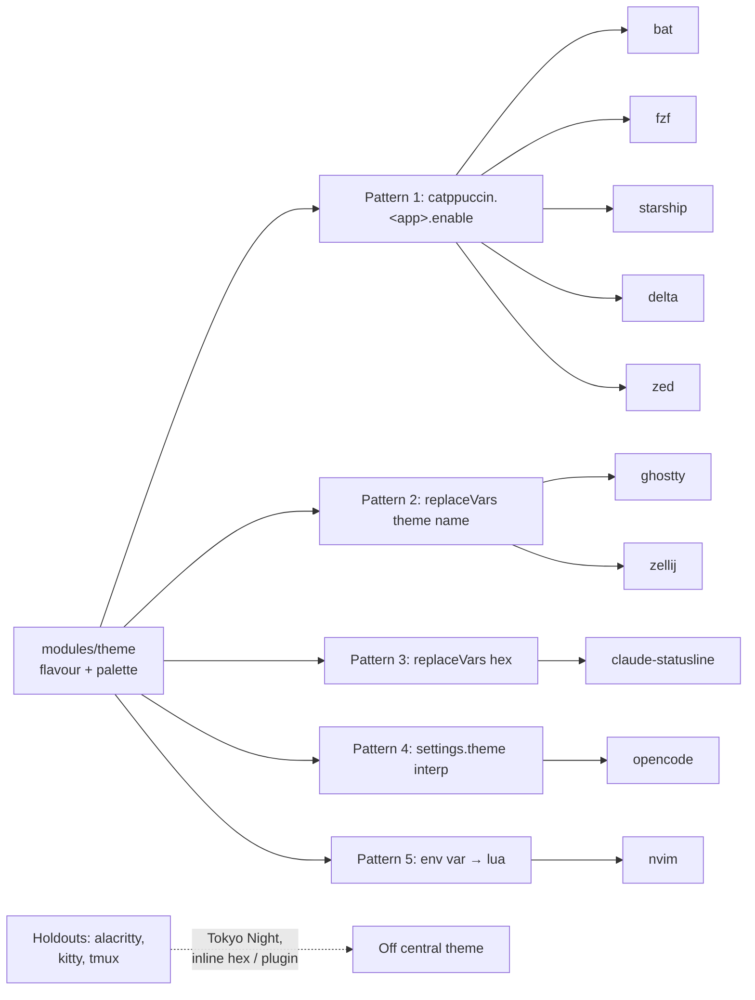

# Refactor: Decouple theming from Catppuccin

**Status**: draft, awaiting open-question resolution.
**Owner**: @phamann.
**Author**: research + plan by Claude (Opus 4.7), 2026-05-14.

---

## 0. TL;DR

Move theming from `catppuccin/nix` (locked to Catppuccin's 4 flavours) to **Stylix** (`nix-community/stylix`) consuming **base24** schemes from `tinted-theming/schemes`, with `stylix.autoEnable = false` so theming stays explicitly opt-in per module — mirroring the current per-app pattern.

Why base24 over base16: tinted-theming's `base24/catppuccin-mocha.yaml` maps **byte-identically** to Catppuccin's full named-colour palette. `mauve` = `base0E` (`#cba6f7`), `lavender` = `base07`, `blue` = `base0D`, etc. — the comments in the YAML are the proof. Switching to base24 buys palette portability **without** losing the granular semantics hand-templated apps depend on.

The win:
- Palette portability — any of ~300 base24 schemes (Catppuccin all flavours, Gruvbox, Nord, Tokyo Night, Solarized, Dracula, …) via one option swap.
- ~3 of your 5 integration patterns collapse: `pkgs.replaceVars` plumbing for ghostty/zellij and the inline `theme = "catppuccin-${flavour}"` interp in opencode all disappear into `stylix.targets.<app>.enable = true`.
- An actively-maintained framework (Stylix: daily commits, ~2,260★ on `nix-community/stylix`) replaces a Catppuccin-only ecosystem.
- A new `modules.theme.semantic` attrset (`{ primary = base0D; success = base0B; … }`) gives hand-templated apps role-named colours that survive scheme swaps.

The cost:
- 2 new flake inputs (`stylix`, `tinted-theming/schemes`).
- 1 explicit `stylix.targets.<x>.enable = true` line per themed module (replaces the per-app `catppuccin.<x>.enable` line).
- 1 module stays manual: `claude-statusline` (no Stylix target — same `pkgs.replaceVars`, sourced from a new role-named `semantic` attrset).

Also bundled into this refactor (per resolved-decisions §6):
- **Delete** `modules/{alacritty,kitty,tmux}` entirely — user no longer uses these (zellij replaces tmux; ghostty replaces alacritty/kitty).
- **Delete** the 7 inert nvim colorscheme plugin files (`tokyonight.lua`, `doom-one.lua`, etc.) — dead code, `vim.g.active_color_scheme = "catppuccin"` only ever selects one.
- **Drop** the catppuccin entry from Zed's extension list (Stylix's zed target writes the theme directly).
- **Remove** the legacy `flavour`/`lightFlavour`/`accent`/`palette` options on `modules.theme` (no consumers post-migration; rename to `scheme`).

**nix-colors was investigated** and ruled out: last commit was 2024-02-13, and its scheme loader doesn't expose base24 slots (only `palette.base00`–`palette.base0F`). Adopting a stale library that can't even consume the format we want is a regression.

---

## 1. Current state

### 1.1 The 5 integration patterns

Documented in `docs/THEMING.md` §2. Reproduced for plan completeness:

| # | Pattern | Modules |
|---|---|---|
| 1 | `catppuccin.<app>.enable = true` (upstream HM module) | `bat`, `fzf`, `starship`, `git/delta`, `zed` |
| 2 | `pkgs.replaceVars` with a theme **name** string | `ghostty`, `zellij` |
| 3 | `pkgs.replaceVars` with raw hex **values** | `claude-code` (statusline) |
| 4 | String interp in `programs.<x>.settings.theme` | `opencode` |
| 5 | `home.sessionVariables.CATPPUCCIN_FLAVOUR` → lua reads `vim.env.CATPPUCCIN_FLAVOUR` | `nvim` |

### 1.2 Themed inventory



### 1.3 Things worth preserving

- **`modules.theme` as a thin shim** — well-designed library API consumed by other modules. The shape stays; the source changes (catppuccin/nix → Stylix + base24 YAML).
- **Profiles set `modules.theme.enable = true`** and hosts override the active scheme — that delta-driven pattern stays.
- **`pkgs.replaceVars` for claude-statusline** — Stylix has no target for `claude-statusline`, so pattern 3 survives. Pulls hex from a new role-named `semantic` attrset that's scheme-agnostic.

### 1.4 What's dated / friction

- **`vim.g.active_color_scheme = "catppuccin"` is hardcoded** in `modules/nvim/config/init.lua:8`. The other 7 colorscheme plugin files (tokyonight, doom-one, github-theme, onedark, onedark-pro, etc.) are inert — they're declared but `active_color_scheme` selects only catppuccin. The "nvim Tokyo Night holdout" in THEMING.md §4 isn't real; it's commented-out option lines above the active one.
- **`pkgs.replaceVars` template files** (`modules/ghostty/config`, `modules/zellij/config.kdl`) carry Catppuccin-specific theme names *and* inline Catppuccin theme definitions (zellij's `themes { catppuccin-latte { … } }`). Both go away with Stylix.
- **`opencode` inlines `theme = "catppuccin-${flavour}"`** — works only as long as opencode ships a `catppuccin-${flavour}` theme. Stylix's opencode target generates the theme from the palette, breaking the dependency on opencode shipping pre-baked themes.
- **Zed has `"catppuccin"` hard-coded in the extensions list** (`modules/zed/default.nix:97`). Stylix's zed target writes a base24 scheme directly into Zed's themes directory, so the extension becomes unused.

---

## 2. State of the art (2025-2026)

### 2.1 Stylix — `nix-community/stylix`

Moved from `danth/stylix` to the `nix-community` org. As of mid-May 2026: ~2,260★, daily commits, tracks `nixos-25.05`/`nixos-25.11` release branches. Warns at build time if the release branch and your `home-manager`/`nix-darwin`/`nixos` major version don't match.

Supports every app in this repo — `bat, fzf, starship, delta, zed, ghostty, kitty, alacritty, tmux, zellij, neovim, opencode` — via `stylix.targets.<app>.enable` (defaults to `config.stylix.autoEnable`).

Granular opt-out:
- `stylix.autoEnable = false` → opt-in per target (the recommended mode for this repo).
- `stylix.autoEnable = true` → opt-out per target.
- Sub-toggles for `colors` / `fonts` / `opacity` per target.

`stylix.darwinModules.stylix` exists; nix-darwin support is real but thin — `stylix.cursor` and `stylix.opacity` are NixOS-only (issue [#2078](https://github.com/nix-community/stylix/issues/2078)). For this repo those don't matter (macOS doesn't expose those concepts to user theming).

### 2.2 nix-colors — `Misterio77/nix-colors`

Last commit 2024-02-13. Not archived but functionally frozen. A pure palette library (~220 base16 schemes), no per-app modules. Crucially: **scheme loader only exposes `palette.base00`–`palette.base0F`** — no base24 support. Adopting a stale library that can't even consume the format we want is the wrong direction. **Skip.**

### 2.3 base24 schemes — `tinted-theming/schemes`

The base16 standard's superset. Same first 16 slots, plus 8 more (`base10`–`base17`) for ANSI bright variants and extra accent shades. The `tinted-theming/schemes` repo has both `base16/` (303 schemes) and `base24/` (hundreds, including all 4 Catppuccin flavours, Gruvbox, Tokyo Night, Solarized, Nord, Dracula).

`pkgs.base16-schemes` in nixpkgs only ships the base16 subset. To access base24 we add `inputs.tinted-schemes.url = "github:tinted-theming/schemes"; inputs.tinted-schemes.flake = false;` and point at `${inputs.tinted-schemes}/base24/<scheme>.yaml`.

Stylix accepts these YAMLs transparently. From [Stylix docs](https://nix-community.github.io/stylix/configuration.html): `stylix.base16Scheme` "also accepts other files and formats supported by `mkSchemeAttrs`" (Stylix's underlying templating engine). [base16.nix's `mkSchemeAttrs` docs](https://github.com/SenchoPens/base16.nix/blob/main/DOCUMENTATION.md) confirm fallback logic for the extended palette:

> `bright-red = base12 or base08; bright-yellow = base13 or base0A; bright-green = base14 or base0B; bright-cyan = base15 or base0C; bright-blue = base16 or base0D; bright-magenta = base17 or base0E`

So when a base24 YAML is supplied, `base10`–`base17` are populated; when a base16 YAML is supplied, the bright aliases fall back to their non-bright counterparts.

**The Catppuccin Mocha base24 YAML is the killer feature.** Here's an extract of `tinted-theming/schemes/base24/catppuccin-mocha.yaml`:

```yaml
system: "base24"
name: "Catppuccin Mocha"
variant: "dark"
palette:
  base00: "#1e1e2e" # base
  base01: "#181825" # mantle
  base05: "#cdd6f4" # text
  base06: "#f5e0dc" # rosewater
  base07: "#b4befe" # lavender
  base08: "#f38ba8" # red
  base09: "#fab387" # peach
  base0A: "#f9e2af" # yellow
  base0B: "#a6e3a1" # green
  base0C: "#94e2d5" # teal
  base0D: "#89b4fa" # blue
  base0E: "#cba6f7" # mauve
  base0F: "#f2cdcd" # flamingo
  base11: "#11111b" # crust
  base12: "#eba0ac" # maroon
  base15: "#89dceb" # sky
  base16: "#74c7ec" # sapphire
  base17: "#f5c2e7" # pink
```

The inline comments encode Catppuccin's named colour semantics into base24 slots. Migration preserves every hex value claude-statusline currently uses.

### 2.4 Reference repos

- [`uttarayan21/dotfiles`](https://github.com/uttarayan21/dotfiles) — nix-darwin + NixOS + HM, Stylix in a 13-line `stylix.nix`. Best minimal model.
- [`librephoenix/nixos-config`](https://github.com/librephoenix/nixos-config) — large NixOS+HM repo with a user-friendly theme-name → base16-scheme-path abstraction layer (closest analogue to a `modules/theme` shim around Stylix).
- [`hyperparabolic/nix-config`](https://github.com/hyperparabolic/nix-config) — flake-parts/dendritic composition (similar to ours), uses `stylix.targets` per module.

---

## 3. Target architecture

### 3.1 Layered model

```mermaid
flowchart TB
  H[hosts/&lt;host&gt;/home.nix<br/>modules.theme.scheme = ...] --> T[modules/theme<br/>maps scheme → stylix.base16Scheme path]
  T -->|stylix.base16Scheme| S[Stylix<br/>HM + darwin modules]
  T -->|semantic = { primary = base0D; ... }| SEM[Role-named colour API]
  S -->|stylix.targets.&lt;app&gt;.enable| AUTO["Auto-themed apps:<br/>bat, fzf, starship, delta,<br/>zed, ghostty, kitty, alacritty,<br/>tmux, zellij, neovim, opencode"]
  SEM -->|pkgs.replaceVars| MANUAL["Manual templating:<br/>claude-statusline"]
```

Three layers replace today's five:

| Layer | Job |
|---|---|
| **`modules/theme`** | Maps a friendly `scheme` option (`"catppuccin-mocha"`, `"gruvbox-dark-hard"`, …) to a base24 YAML path and sets `stylix.base16Scheme`. Exposes a `semantic` attrset (role-named colours) for hand-templated apps. |
| **Stylix** | Auto-themes every app whose module sets `stylix.targets.<app>.enable = true`. |
| **App modules** | Each themed module sets `stylix.targets.<name>.enable = true` next to its existing `programs.<name>.enable = true`. Replaces the `catppuccin.<name>.enable` and `pkgs.replaceVars` plumbing. |

### 3.2 Target `modules/theme/default.nix` (sketch)

```nix
{ inputs, lib, config, ... }:
let
  inherit (lib) mkEnableOption mkIf mkOption types;
  cfg = config.modules.theme;
  c = config.lib.stylix.colors;
in {
  imports = [ inputs.stylix.homeModules.stylix ];

  options.modules.theme = {
    enable = mkEnableOption "theme";

    scheme = mkOption {
      type = types.str;
      default = "catppuccin-mocha";
      description = ''
        Base24 scheme name (without `.yaml`) as shipped by
        `tinted-theming/schemes` under `base24/`. Browse:
          ${inputs.tinted-schemes}/base24/
        Or list: `ls ${inputs.tinted-schemes}/base24 | sed 's/\.yaml//'`
      '';
    };

    polarity = mkOption {
      type = types.enum [ "dark" "light" "either" ];
      default = "dark";
    };

    # Role-named colour API for hand-templated apps. Scheme-agnostic —
    # switching from Catppuccin to Gruvbox swaps the hex values, but
    # `primary`/`success`/`accent` keep meaning. Use as
    # `inherit (config.modules.theme.semantic) primary accent;` in modules.
    semantic = mkOption {
      type = types.attrsOf types.str;
      readOnly = true;
      default = {
        # Foreground / background
        bg = c.base00;
        fg = c.base05;
        bgAlt = c.base01;
        fgAlt = c.base04;

        # Status / signal
        primary = c.base0D;  # blue
        success = c.base0B;  # green
        warning = c.base0A;  # yellow
        error = c.base08;    # red
        info = c.base0C;     # teal/cyan

        # Accents
        accent = c.base0E;       # mauve / magenta
        accentAlt = c.base07;    # lavender / pale accent
        accentBright = c.base17; # bright magenta / pink
      };
      defaultText = "role-named hex values derived from the active base24 scheme";
    };
  };

  config = mkIf cfg.enable {
    stylix = {
      enable = true;
      base16Scheme = "${inputs.tinted-schemes}/base24/${cfg.scheme}.yaml";
      polarity = cfg.polarity;

      # Don't auto-theme every app — modules opt in explicitly.
      autoEnable = false;

      # Fonts — Stylix needs these even with autoEnable=false because
      # they're foundational. Reuse what every host already uses.
      fonts.monospace = {
        package = pkgs.nerd-fonts.jetbrains-mono;
        name = "JetBrainsMono Nerd Font Mono";
      };
    };
  };
}
```

Changes from today's `modules/theme`:
- `flavour` (Catppuccin enum) → `scheme` (free-form base24 name).
- `accent` (Catppuccin-specific) → dropped; Stylix derives accents from the scheme.
- `palette` (Catppuccin colour names) → split into:
  - `config.lib.stylix.colors.base0X` (raw base24 slots, available everywhere) — for any app templating that wants direct base24 access.
  - `modules.theme.semantic.<role>` (role-named) — for hand-templated apps that prefer semantic names.

### 3.3 Per-module changes

| Module | Today | After |
|---|---|---|
| `bat` | `catppuccin.bat.enable = true;` | `stylix.targets.bat.enable = true;` |
| `fzf` | `catppuccin.fzf.enable = true;` | `stylix.targets.fzf.enable = true;` |
| `starship` | `catppuccin.starship.enable = true;` | `stylix.targets.starship.enable = true;` |
| `git/delta` | `catppuccin.delta.enable = true;` | `stylix.targets.delta.enable = true;` |
| `zed` | `catppuccin.zed.enable = true;` + `extensions = [ "catppuccin" ];` | `stylix.targets.zed.enable = true;` — drop the extension. |
| `ghostty` | `pkgs.replaceVars ./config { theme = …; }` + template file | `stylix.targets.ghostty.enable = true;`. **Delete** `modules/ghostty/config`; move non-theme settings to `programs.ghostty.settings`. |
| `zellij` | `pkgs.replaceVars ./config.kdl { theme = …; }` + inline `themes { catppuccin-… { } }` blocks | `stylix.targets.zellij.enable = true;`. **Delete** the four catppuccin theme blocks and the `theme "@theme@"` line from `config.kdl`. |
| `opencode` | `settings.theme = "catppuccin-${themeCfg.flavour}";` | `stylix.targets.opencode.enable = true;`. Drop the `theme = …` line from `settings`. |
| `nvim` | `home.sessionVariables.CATPPUCCIN_FLAVOUR` → lua reads it | `stylix.targets.neovim.enable = true;`. **Delete** `vim.g.active_color_scheme` line and the 7 inert colorscheme plugin files. |
| `claude-code` statusline | `pkgs.replaceVars ./config.toml { inherit (palette) blue green mauve yellow lavender; }` | `pkgs.replaceVars ./config.toml { inherit (themeCfg.semantic) primary success accent warning accentAlt; }`. **Rename** the `@blue@`/`@green@`/`@mauve@`/`@yellow@`/`@lavender@` substitution markers in `config.toml` to `@primary@`/`@success@`/`@accent@`/`@warning@`/`@accentAlt@`. Same hex values render under Catppuccin Mocha base24; scheme-portable. |
| `alacritty` | inline Tokyo Night hex | **Delete `modules/alacritty/` entirely.** Also remove the `../../modules/alacritty` import and `alacritty.enable = true;` from `hosts/x-wing/home.nix`. |
| `kitty` | hex codes in `kitty.conf` | **Delete `modules/kitty/` entirely.** Already disabled on every host post-Phase-4; pure dead-code removal. |
| `tmux` | `tokyo-night-tmux` plugin + base-profile enable | **Delete `modules/tmux/` entirely.** Remove `../modules/tmux` import and `tmux.enable = true;` from `profiles/base.nix`. Remove the `tmux = "tmux -2";` shell alias from `modules/zsh/default.nix:37`. Update `docs/THEMING.md §4` to drop the tmux reference. |
| `flake/modules.nix` | publishes 19 HM modules including alacritty, kitty, tmux | Unpublish alacritty/kitty/tmux from the `flake.homeManagerModules` list. |

`modules/theme/default.nix.home.sessionVariables.CATPPUCCIN_*` → deleted entirely.

### 3.4 Catppuccin → base24 fidelity proof

Concrete byte-equivalence under Catppuccin Mocha base24 (from the tinted-theming YAML):

| claude-statusline substitution | Today's source | base24 slot | Hex |
|---|---|---|---|
| `@blue@` | `palette.blue` | `base0D` (`semantic.primary`) | `#89b4fa` ✓ |
| `@green@` | `palette.green` | `base0B` (`semantic.success`) | `#a6e3a1` ✓ |
| `@mauve@` | `palette.mauve` | `base0E` (`semantic.accent`) | `#cba6f7` ✓ |
| `@yellow@` | `palette.yellow` | `base0A` (`semantic.warning`) | `#f9e2af` ✓ |
| `@lavender@` | `palette.lavender` | `base07` (`semantic.accentAlt`) | `#b4befe` ✓ |

No visual regression at the migration cutover. Swap the scheme name to `"gruvbox-dark-medium"` later and the semantic slots remap consistently (different colours, same roles).

### 3.5 Net code change estimate

- **+2 flake inputs** (`stylix`, `tinted-schemes`)
- **~12 lines added** (one `stylix.targets.<x>.enable = true` per themed module)
- **~600+ lines deleted:**
  - `modules/alacritty/default.nix` (~335 LoC — bulk is commented theme-variant blocks)
  - `modules/kitty/` (default.nix + `kitty.conf` + `kitty.app.icns` — ~80 LoC + binary)
  - `modules/tmux/default.nix` (~70 LoC)
  - 7 inert nvim colorscheme plugin files (~80 LoC)
  - The four catppuccin zellij theme blocks (~50 LoC)
  - `modules/ghostty/config` (~9 LoC template)
  - `home.sessionVariables.CATPPUCCIN_*` block
  - Catppuccin entry in zed `extensions` list
- **Net: ~−590 LoC.** A lot of the delta is removing modules the user no longer uses (Q1), independent of the theming switch.

---

## 4. Migration phases

Each phase is independently shippable; you can stop after any phase and have a coherent repo.

### Phase A — Add inputs, swap `modules/theme` (foundation)

- Add flake inputs:
  ```nix
  stylix.url = "github:nix-community/stylix/release-25.11";
  stylix.inputs.nixpkgs.follows = "nixpkgs";

  tinted-schemes.url = "github:tinted-theming/schemes";
  tinted-schemes.flake = false;
  ```
- Rewrite `modules/theme/default.nix` per §3.2.
- Add `stylix.darwinModules.stylix` to `flake/hosts.nix`'s `mkDarwin` module list (so font / Stylix integration works at the system layer).
- Hosts: change `modules.theme.flavour = "frappe"` (or `mocha`) to `modules.theme.scheme = "catppuccin-frappe"` (or `"catppuccin-mocha"`).
- **No per-app changes yet.** Stylix is loaded but `autoEnable = false` and no module sets a target — visual behaviour identical to current state (existing `catppuccin.<x>.enable` lines still drive theming through catppuccin/nix until Phase B). Both inputs coexist briefly.
- Exit criteria: `nix flake check` passes; `make r2-d2` rebuilds; visuals unchanged.

### Phase B — Migrate the `catppuccin.<x>.enable` modules

- For each of `bat`, `fzf`, `starship`, `git/delta`, `zed`:
  - Replace `catppuccin.<x>.enable = true;` with `stylix.targets.<x>.enable = true;`.
  - For `zed`: drop `"catppuccin"` from the `extensions` list.
- Exit criteria: those 5 apps now derive colours from `stylix.base16Scheme` (base24 Catppuccin Mocha) instead of `catppuccin.flavor`. Visual diff should be negligible because the base24 YAML carries the same Catppuccin hex values.

### Phase C — Migrate templated apps (ghostty, zellij, opencode)

- `modules/ghostty/default.nix`: drop `pkgs.replaceVars`, set `stylix.targets.ghostty.enable = true`. Move font/padding/fullscreen settings to `programs.ghostty.settings = { ... }`.
- `modules/ghostty/config`: **delete** (no longer templated).
- `modules/zellij/default.nix`: drop `pkgs.replaceVars`, set `stylix.targets.zellij.enable = true`. The `layout = "${cfg.layout}";` substitution moves to `programs.zellij.settings.default_layout`.
- `modules/zellij/config.kdl`: delete the four `catppuccin-*` theme blocks and the `theme "@theme@"` line. Keep only structural config (keybinds, plugins, ui).
- `modules/opencode/default.nix`: drop `settings.theme = "catppuccin-${...}";`, set `stylix.targets.opencode.enable = true`.

### Phase D — Migrate nvim

- Set `stylix.targets.neovim.enable = true` in `modules/nvim/default.nix`.
- Stylix's nvim target injects `mini.base16.setup({ palette = { ... } })` into `programs.neovim.extraLuaConfig`. This causes home-manager to start writing `~/.config/nvim/init.lua`, which collides with the pre-Phase-D `xdg.configFile.nvim = { recursive = true; ... }` claim. **Narrow the symlink scope:** in `modules/nvim/default.nix`, replace the single recursive `xdg.configFile.nvim` claim with per-subfile claims for `xdg.configFile."nvim/lua"` and `xdg.configFile."nvim/lazy-lock.json"`. The repo's `init.lua` content moves to `programs.neovim.extraLuaConfig` (its 4 `require()` lines).
- Delete the standalone `modules/nvim/config/init.lua` file. Its content lives in `extraLuaConfig` now.
- Delete 10 colorscheme plugin files (turned out to be 10, not 7 as the initial plan said): `catppuccin.lua`, `doom-one.lua`, `github-theme.lua`, `kanagawa.lua`, `material.lua`, `nightfox.lua`, `onedark.lua`, `onedark-pro.lua`, `rose-pine.lua`, `tokyonight.lua`. Stylix's `mini.base16` integration replaces `catppuccin.lua`; the other 9 were already inert.
- Clean up `vim.g.active_color_scheme` consumers:
  - `plugin-manager.lua`: drop `install.colorscheme = { vim.g.active_color_scheme }` (lazy.nvim doesn't need a preferred scheme).
  - `barbecue.lua`: drop `theme = vim.g.active_color_scheme` from opts (barbecue auto-derives from current highlights).
  - `styler.lua`: drop the `markdown.colorscheme` override (no per-filetype override today).
- Drop `home.sessionVariables.CATPPUCCIN_*` from `modules/theme/default.nix`. nvim was the only consumer.
- Exit criteria: nvim launches with stylix-generated colours; no env-var dance.

#### Activation note (read before `make <host>`)

The narrowing of `xdg.configFile.nvim` from a recursive symlink to per-file claims is **not safe for home-manager activation against a host that previously had the recursive shape**. The failure mode:

1. Pre-Phase-D state on a real host: `~/.config/nvim → /nix/store/.../hm_config → <repo>/modules/nvim/config` (a chain of symlinks; the user's nvim config dir IS the repo dir via mkOutOfStoreSymlink).
2. `make <host>` activates Phase D. HM builds a new `home-manager-files` derivation with per-file children (`nvim/init.lua`, `nvim/lua`, `nvim/lazy-lock.json` as separate entries).
3. HM activation tries to install the new children INTO `~/.config/nvim/`. But `~/.config/nvim` is still the old recursive symlink pointing at the repo. So the new children get written THROUGH the symlink, ending up as stray files at `<repo>/modules/nvim/config/{init.lua, lua, lazy-lock.json}` — symlinks pointing back into the new HM store.
4. Worse, HM creates `lazy-lock.json.hm-backup` and `lua.hm-backup` inside the repo dir (backups of the pre-activation state) — adding to the mess.
5. After all that, the parent `~/.config/nvim` symlink isn't updated to point at the new store. It still resolves to the repo, which now contains a symlink loop: `<repo>/lua → /nix/store/.../home-manager-files/.../lua`, and that store path is itself a `mkOutOfStoreSymlink` back to `<repo>/lua`.
6. Result: nvim launches, fails with `module 'options' not found` because the lua loader hits "Too many levels of symbolic links" trying to resolve `~/.config/nvim/lua/options.lua`.

**Prep step before `make <host>` (run once per Mac that had the pre-Phase-D recursive symlink):**

```sh
# Remove the stale recursive symlink so HM activation can create the
# new narrow-scope structure cleanly.
rm ~/.config/nvim

# Then run the rebuild as usual.
make <host>
```

If the failure has already happened (stray symlinks in the repo + symlink loop), recovery is:

```sh
# Clean the stray HM-written symlinks and backups in the repo.
cd ~/.config/nixpkgs/modules/nvim/config
rm -f init.lua lua lazy-lock.json
rm -rf lua.hm-backup lazy-lock.json.hm-backup

# Restore the real repo files from git.
cd ~/.config/nixpkgs
git checkout HEAD -- modules/nvim/config/lua modules/nvim/config/lazy-lock.json

# Nuke the stale home symlink.
rm ~/.config/nvim

# Re-run the rebuild.
make <host>
```

yoda is unaffected by this trap because `nvim.dev = false` on yoda (the pre-Phase-D config used `source = ./config` which copies into the store rather than a recursive mkOutOfStoreSymlink). Only `nvim.dev = true` hosts (x-wing, r2-d2) need the prep step.

#### lazy.nvim + Stylix interaction

Stylix's nvim target installs `pkgs.vimPlugins.mini-nvim` via `programs.neovim.plugins` (lands at `pack/myNeovimPackages/start/mini.nvim`) AND appends `require('mini.base16').setup({palette=...})` to `extraLuaConfig`. That snippet runs at the **end** of init.lua, after our `require("plugin-manager")` call which executes `lazy.setup()`.

lazy.nvim defaults `performance.rtp.reset = true`, which clears `vim.opt.rtp` to roughly `{ stdpath('config'), VIMRUNTIME, lazypath }` before re-adding plugins lazy manages. That wipes nvim's packpath entries — so by the time Stylix's appended `require('mini.base16')` fires, the plugin Stylix installed is no longer reachable. Error: `module 'mini.base16' not found`.

Fix: declare mini.nvim as a normal lazy plugin spec with eager loading. `modules/nvim/config/lua/plugins/mini.lua`:

```lua
return {
    "echasnovski/mini.nvim",
    lazy = false,
    priority = 1000,
}
```

`lazy = false` makes it a start plugin; `priority = 1000` orders it before other start plugins. By the time `lazy.setup()` returns, mini.nvim is on rtp from lazy's own clone in `~/.local/share/nvim/lazy/`, and the trailing setup call resolves.

Caveat — duplicate install: Stylix has no opt-out for `programs.neovim.plugins`, so mini.nvim ends up installed twice (nix-store packpath copy + lazy git clone). The packpath copy is unreachable after lazy's rtp reset; lazy's copy is what gets used. ~5MB of disk waste, otherwise harmless. To deduplicate would require either overriding `programs.neovim.plugins` to filter Stylix's entry or disabling `stylix.targets.neovim.enable` and re-emitting the palette setup ourselves — neither worth the abstraction violation.

### Phase E — Delete unused terminal modules (alacritty / kitty / tmux)

Per Q1: the user no longer uses any of these. zellij + ghostty cover the workflow.

- `git rm -r modules/alacritty/` — including the inline Tokyo Night hex and the four commented-out alternative theme blocks.
- `git rm -r modules/kitty/` — including `kitty.conf`, `kitty.app.icns`. No host enables it post-Phase-4; pure dead-code removal.
- `git rm -r modules/tmux/` — including `default.nix` (which carries the `tokyo-night-tmux` plugin definition).

Downstream cleanup (each is required for `nix flake check` to pass after deletion):
- `profiles/base.nix`: remove `../modules/tmux` from `imports` and `tmux.enable = true;` from `modules`.
- `modules/zsh/default.nix:37`: remove the `tmux = "tmux -2";` shellAlias.
- `hosts/x-wing/home.nix`: remove `../../modules/alacritty` from `imports` and `alacritty.enable = true;` from `modules`. The file collapses to `imports = [ ../../profiles/dev-laptop.nix ]; modules.theme.scheme = "catppuccin-frappe";`.
- `flake/modules.nix`: remove `alacritty`, `kitty`, `tmux` entries from `flake.homeManagerModules`.
- `docs/THEMING.md`: the §4 "What's NOT themed by `modules.theme`" table — drop the alacritty/kitty/tmux rows; the nvim row needs revisiting (Phase D handles).

Exit criteria: `nix flake check` passes; no references to `alacritty`/`kitty`/`tmux` modules anywhere in the repo (`rg -i '\b(alacritty|kitty|tmux)\b' modules/ profiles/ hosts/ flake/` returns clean).

### Phase F — Migrate claude-statusline (semantic templating)

- `modules/claude-code/default.nix`: change the `pkgs.replaceVars` source from `config.modules.theme.palette` (Catppuccin colour names) to `themeCfg.semantic` (role-named):
  ```nix
  home.file.".config/claude-statusline/config.toml".source =
    pkgs.replaceVars ./config.toml {
      inherit (themeCfg.semantic) primary success accent warning accentAlt;
    };
  ```
- Update `modules/claude-code/config.toml`: rename `@blue@` → `@primary@`, `@green@` → `@success@`, `@mauve@` → `@accent@`, `@yellow@` → `@warning@`, `@lavender@` → `@accentAlt@`.
- The `modules/theme.palette` option can be removed entirely after this, or left as an alias for backwards-compat (recommend remove — see Q5).

### Phase G — Cleanup

- Remove `inputs.catppuccin` from `flake.nix`.
- Update `docs/THEMING.md` to reflect the new patterns (likely shrinks to: `stylix.targets.<x>.enable` for everything Stylix handles + `pkgs.replaceVars + modules.theme.semantic` for claude-statusline + an explanation of the base24-via-`tinted-schemes` choice).
- Remove the legacy `modules.theme.flavour` / `lightFlavour` / `accent` options if not kept as compatibility shims (Q5).
- Remove `home.sessionVariables.CATPPUCCIN_*` if not done in Phase D.

---

## 5. Decision log

(Pre-populated with my recommendations; user to confirm in §6.)

| ID | Decision | Rationale |
|---|---|---|
| **T1** | **Adopt Stylix** (not nix-colors, not raw `pkgs.base16-schemes`). | nix-colors is unmaintained AND lacks base24 support (its loader only exposes `base00`–`base0F`). Stylix actively maintained, accepts base24 transparently via its `mkSchemeAttrs` underlying lib. |
| **T2** | **Use base24 schemes, not base16.** | base24 maps Catppuccin's 26 named colours into 24 slots with explicit semantic preservation (the YAML has Catppuccin names as inline comments). Migration is byte-fidelity-preserving. base16's 16 slots forces approximate mapping that loses the `mauve`/`lavender`/`sky`/`sapphire` distinctions hand-templated apps depend on. |
| **T3** | **Source from `tinted-theming/schemes` (flake input), not `pkgs.base16-schemes`.** | nixpkgs's package is base16-only (303 schemes, no `base24/` subdir — confirmed by inspection). The canonical base24 source is `github:tinted-theming/schemes`. |
| **T4** | **`stylix.autoEnable = false`.** Opt in per target. | Mirrors current per-app enable pattern. Sidesteps "Stylix re-themed my X" footgun. Visible mental model: one `stylix.targets.<x>.enable` line per module, parallels `programs.<x>.enable`. |
| **T5** | **Expose a `semantic` role-named attrset** (`primary`, `success`, `accent`, …) in `modules/theme`. | Hand-templated apps (claude-statusline) should consume role-named colours, not theme-specific names. Switching scheme later swaps hex values but the role mapping survives. Avoids the "rename `@blue@` to `@base0D@` then again to `@gruvbox-blue@`" anti-pattern. |
| **T6** | **Default scheme: `catppuccin-mocha`** during migration. | Zero visual change for r2-d2 (currently mocha). x-wing and yoda are on frappe today — they'll either stay frappe (`catppuccin-frappe`) or jump to mocha (Q3). |

---

## 6. Resolved planning decisions

Captured from planning discussion 2026-05-14. Reflected throughout the phases above; this section is the audit trail.

| ID | Question | Decision | Impacts |
|---|---|---|---|
| **R1** | alacritty / kitty / tmux: keep off central scheme, unify, or delete? | **Delete entirely.** User no longer uses these; zellij + ghostty cover the workflow. | Phase E becomes a 3-module deletion with downstream cleanup in `profiles/base.nix`, `modules/zsh`, `hosts/x-wing/home.nix`, `flake/modules.nix`, `docs/THEMING.md`. ~485 LoC removed across the three modules + downstreams. |
| **R2** | nvim: drop the 7 inert colorscheme plugins (tokyonight, doom-one, github-theme, onedark, onedark-pro, …)? | **Drop them entirely.** They're declared but `vim.g.active_color_scheme = "catppuccin"` only ever selects one — the rest is dead loading. | Phase D `git rm`s 7 lua plugin files (~80 LoC). `catppuccin.lua` retention is conditional on Stylix's nvim target — verify and keep or drop accordingly. |
| **R3** | Default scheme on cutover: per-host or standardise? | **Per-host:** r2-d2 → `catppuccin-mocha`, x-wing → `catppuccin-frappe`, yoda → `catppuccin-frappe`. | Zero visual diff at cutover; cleanest A/B compare for Phase B+C+D verification. Standardisation can happen later as a one-line host edit. |
| **R4** | Drop the catppuccin Zed extension? | **Drop it.** Stylix's zed target writes the theme directly. | Phase B removes `"catppuccin"` from `modules/zed/default.nix.extensions`. |
| **R5** | Legacy options on `modules.theme` (flavour, lightFlavour, accent, palette): remove or keep as shims? | **Remove in Phase G.** No consumers after migration. Shims add cognitive load with no benefit in a one-developer repo. | Phase G deletes 4 option declarations. Host files (already updated in Phase A) use `scheme` instead. |
| **R6** | Migration cadence: pilot one host, or all-at-once? | **All-at-once.** base24 Catppuccin gives byte-fidelity; visual regression risk near-zero. Phase B verifies on r2-d2; x-wing/yoda follow with high confidence. | Single branch carries Phases A–G. No temporary forks of `modules/theme`. |
| **R7** | Rename `modules.theme.flavour` → `modules.theme.scheme`? | **Rename.** `scheme` is semantic-neutral, matches Stylix's `base16Scheme` terminology, honest about accepting any base24 scheme name. | Phase A's `modules/theme` rewrite uses `scheme`. Host files set `modules.theme.scheme = "catppuccin-mocha"` etc. — same single-line edit as today. |

---

## 7. References

- [nix-community/stylix](https://github.com/nix-community/stylix) — repo
- [Stylix configuration docs](https://nix-community.github.io/stylix/configuration.html) — quote: `stylix.base16Scheme` accepts "files and formats supported by `mkSchemeAttrs`"
- [Stylix target list](https://nix-community.github.io/stylix/options/modules/) — per-app option pages
- [Stylix tricks (disabling modules, opting out)](https://nix-community.github.io/stylix/tricks.html)
- [Stylix issue #2078](https://github.com/nix-community/stylix/issues/2078) — nix-darwin option coverage gap
- [SenchoPens/base16.nix DOCUMENTATION.md](https://github.com/SenchoPens/base16.nix/blob/main/DOCUMENTATION.md) — confirms base24 fallback logic (`bright-red = base12 or base08`)
- [tinted-theming/schemes](https://github.com/tinted-theming/schemes) — base16/ and base24/ canonical source
- [tinted-theming gallery](https://tinted-theming.github.io/tinted-gallery/) — visual browser, filterable by Base16 / Base24 / Tinted8
- [Misterio77/nix-colors](https://github.com/Misterio77/nix-colors) — unmaintained alternative (Feb 2024)
- [tinted-theming/tinty](https://github.com/tinted-theming/tinty) — runtime scheme switcher (not used here, but worth knowing)
- Reference repos: [uttarayan21/dotfiles](https://github.com/uttarayan21/dotfiles), [librephoenix/nixos-config](https://github.com/librephoenix/nixos-config), [hyperparabolic/nix-config](https://github.com/hyperparabolic/nix-config)
- [Migrated from catppuccin-nix to Stylix (Discourse)](https://discourse.nixos.org/t/migrated-from-catppuccin-nix-to-stylix/63580)
